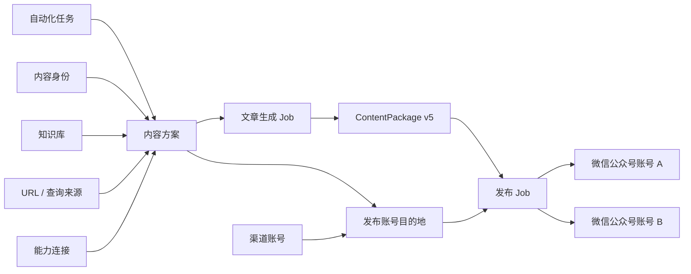

# TrendPublish

TrendPublish 是一个以 ReAct Agent 为核心的自动化内容生产与多渠道发布系统。它把内容身份、策略、授权工具和发布账号组合成可复用配置，先生成共享 `MasterContent`，再为每个账号与发布类型生成独立渠道变体。

当前内置原生 Tool Calling、共享内容 Agent 和微信公众号图文适配 Agent；新增搜索、证据、音频、视频或渠道类型时不需要修改主流程。

## 核心模型



- 内容生成和渠道发布完全分开。同一内容包可以发布到多个目标，每个目标独立成功或失败。
- 自动化任务是日常运行入口，把内容方案、领域参考、发布账号和触发方式组合成长期配置；一次执行会留下独立运行记录。
- 内容方案选择策略、原生 Tool Calling 模型、授权连接工具与增强工具。策略只声明目标和偏好，不规定工具顺序。
- 作者与大模型只编辑带引用注解的 Markdown `ArticleSource`；系统编译为稳定的 `ArticleDocument` AST。有效引用会被严格校验，无效引用会移除链接并作为普通文本保留。
- 共享 ReAct Agent 自主决定搜索、抓取、证据核验、写作和增强顺序，并在明确的 turn 与工具预算内提交 `MasterContent`。
- 每个发布类型拥有版本化领域规则、输出 JSON Schema 和独立 ReAct 会话；单个渠道适配失败不会影响其他渠道。
- 真实发布不是 Agent 工具。Runtime 在渠道稿校验通过后确定性上传资源和调用渠道 API。
- 外部 API 统一通过 `packages/connectors` 调用。`source-search` 只发现候选 URL，`source-fetch` 负责抓取正文；搜索摘要不会直接成为证据。Connector 只做协议映射和一次请求，不承载业务重试、任务恢复或流程状态。
- `ContentAsset.checksum` 是资源实际字节的 SHA-256；`ContentPackage.checksum` 保护冻结包载荷，并在发布前再次验证。
- 一次运行聚合主 ReAct 与各目的地发布会话；活动按实际发生顺序实时展示。模型原始增量只在对应轮次活动中临时显示，内部 Job/Task 按副作用语义负责恢复和幂等。

## 快速开始

需要 Node.js 24+、pnpm 10 和 Vite+ CLI `vp`。

```bash
vp install
cp trendpublish.config.example.ts trendpublish.config.ts
vp run doctor
vp run dev
```

打开 `http://localhost:8000/dashboard/`：

1. 在“连接”中创建并测试模型连接。
2. 创建内容身份；按需维护知识库、URL 或查询来源。
3. 创建内容方案，选择 Agent 策略、来源、授权工具连接和增强能力。
4. 创建自动化任务并选择内容方案；发布方式和目标由内容方案保存。
5. 从任务列表手动运行；完成后的内容包和发布结果分别进入内容库与运行记录。

`trendpublish.config.ts` 只配置部署基础设施：服务鉴权、SQLite 路径和可观测性。连接、密钥和业务对象只从 Dashboard 写入运行时存储，不从旧配置或环境变量导入。

## 常用命令

```bash
vp run dev                 # 本地 API 与 Dashboard 开发服务器
vp run doctor              # 检查基础配置和数据库
vp run verify              # 类型、格式、Lint、测试与 Dashboard 构建
vp test                    # 全仓测试
vp run relay               # 固定 IP 微信 Relay
vp run cf:migrate          # 应用 D1 schema
vp run cf:deploy           # 构建 Dashboard 并部署 Worker
vp run cf:smoke --url https://<worker> --api-key <key>
```

## 包结构

| 包                    | 职责                                                       |
| --------------------- | ---------------------------------------------------------- |
| `packages/runtime`    | Run/Session/Activity、Job/Task、检查点与未知副作用状态     |
| `packages/connectors` | 外部服务定义、连接、凭证、请求覆盖和纯 API Client          |
| `packages/agent`      | 原生 Tool Calling ReAct 循环、工具预算与持久化 observation |
| `packages/article`    | `MasterContent`、`ContentPackage v5`、文章来源与确定性编译 |
| `packages/publishing` | 内部渠道注册表、发布类型、Adapter 与独立目的地扇出发布     |
| `packages/core`       | 工作区模型，以及文章/发布应用用例                          |
| `apps/server`         | HTTP API、本地 SQLite、Cloudflare D1 与运行时装配          |
| `apps/dashboard`      | React 管理界面                                             |
| `packages/ops`        | Doctor、Cloudflare 和 Relay 运维命令                       |

旧的 `workflow`、`integrations`、`agents` 包和旧迁移链已经移除；新代码不得重新依赖它们。边界由 `tests/architecture-boundaries.test.ts` 持续验证。

更多内容见 [快速开始](docs/getting-started.md)、[配置](docs/configuration.md)、[架构](docs/architecture.md) 和 [部署](docs/deployment.md)。
