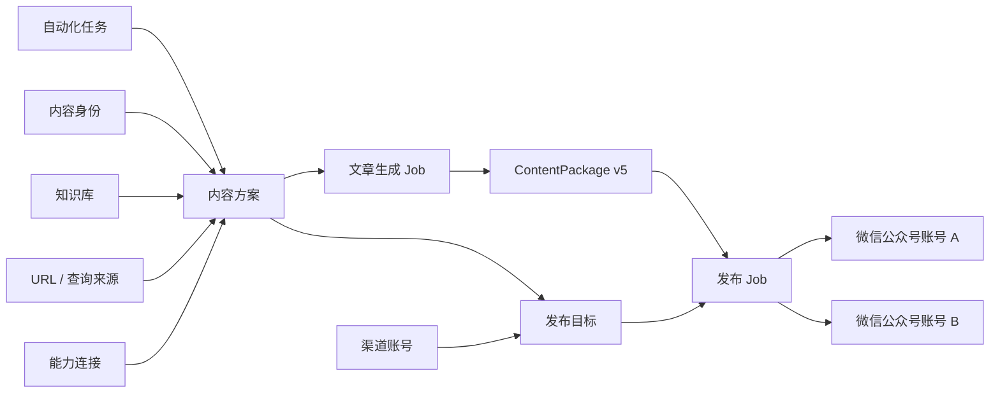

# TrendPublish

TrendPublish 是一个以内容质量为核心的自动化内容生产与多渠道发布系统。它把内容身份、来源、文章插件、外部服务连接和发布目标组合成可复用配置，生成平台中立的 `ContentPackage v5`，再独立分发到一个或多个渠道账号。

当前内置文章生产 Pipeline 和微信公众号发布；架构允许继续增加内容变换、质量评估、资源生产、外部 API Connector 与渠道 Adapter，而不需要改写已有主链路。

## 核心模型



- 内容生成和渠道发布完全分开。同一内容包可以发布到多个目标，每个目标独立成功或失败。
- 自动化任务是日常运行入口，把内容方案、领域参考、发布目标和触发方式组合成长期配置；一次执行会留下独立运行记录。
- 内容方案组合身份、URL / 查询来源、文章插件和能力连接。研究与写作属于固定 Pipeline；文章插件只有 `Transformer`、`Evaluator`、`EvidenceSupplementer`、`AssetProvider` 四类能力。
- 作者与大模型只编辑带引用注解的 Markdown `ArticleSource`；系统编译为稳定的 `ArticleDocument` AST。每篇成品至少包含一条指向有效证据的引用，证据定位必须通过校验，AST 始终由编译器拥有。
- 质量循环由 Pipeline 集中控制在明确预算内。每轮按“评估、按需补证、集中修订”执行，无法消除的阻断问题进入人工审阅；资料不足可以正常返回 `NoContent`，二者都不是执行失败。
- 资源请求只分增强项与必要项：增强项失败时省略并告警，必要项失败时进入人工审阅。自动发布到微信公众号的内容方案会在生产前要求必要封面和可用的图片连接。
- 外部 API 统一通过 `packages/connectors` 调用。`source-search` 只发现候选 URL，`source-fetch` 负责抓取正文；搜索摘要不会直接成为证据。Connector 只做协议映射和一次请求，不承载业务重试、任务恢复或流程状态。
- `ContentAsset.checksum` 是资源实际字节的 SHA-256；`ContentPackage.checksum` 保护冻结包载荷，并在发布前再次验证。
- 所有生成和发布动作都是 Job；内部 Task 按副作用语义保存检查点，可重放安全步骤，并阻止不确定的外部副作用被盲目重复。

## 快速开始

需要 Node.js 24+、pnpm 10 和 Vite+ CLI `vp`。

```bash
vp install
cp trendpublish.config.example.ts trendpublish.config.ts
vp run doctor
vp run dev
```

打开 `http://localhost:8000/dashboard/`：

1. 在“连接”中创建并测试模型连接。
2. 创建内容身份；按需维护知识库、URL 或查询来源。
3. 创建内容方案，选择来源、插件和所需连接。
4. 创建自动化任务并选择内容方案；发布方式和目标由内容方案保存。
5. 从任务列表手动运行；完成后的内容包和发布结果分别进入内容库与运行记录。

`trendpublish.config.ts` 只配置部署基础设施：服务鉴权、SQLite 路径和可观测性。连接、密钥和业务对象只从 Dashboard 写入运行时存储，不从旧配置或环境变量导入。

## 常用命令

```bash
vp run dev                 # 本地 API 与 Dashboard 开发服务器
vp run doctor              # 检查基础配置和数据库
vp run verify              # 类型、格式、Lint、测试与 Dashboard 构建
vp test                    # 全仓测试
vp run relay               # 固定 IP 微信 Relay
vp run cf:migrate          # 应用 D1 schema
vp run cf:deploy           # 构建 Dashboard 并部署 Worker
vp run cf:smoke --url https://<worker> --api-key <key>
```

## 包结构

| 包                    | 职责                                                     |
| --------------------- | -------------------------------------------------------- |
| `packages/runtime`    | Job/Task、检查点、幂等与未知副作用状态                   |
| `packages/connectors` | 外部服务定义、连接、凭证、请求覆盖和纯 API Client        |
| `packages/article`    | `ContentPackage v5`、文章来源、AST 编译、Pipeline 与插件 |
| `packages/publishing` | 渠道账号、发布目标、Adapter 与独立扇出发布               |
| `packages/core`       | 工作区模型，以及文章/发布应用用例                        |
| `apps/server`         | HTTP API、本地 SQLite、Cloudflare D1 与运行时装配        |
| `apps/dashboard`      | React 管理界面                                           |
| `packages/ops`        | Doctor、Cloudflare 和 Relay 运维命令                     |

旧的 `workflow`、`integrations`、`agents` 包和旧迁移链已经移除；新代码不得重新依赖它们。边界由 `tests/architecture-boundaries.test.ts` 持续验证。

更多内容见 [快速开始](docs/getting-started.md)、[配置](docs/configuration.md)、[架构](docs/architecture.md) 和 [部署](docs/deployment.md)。
