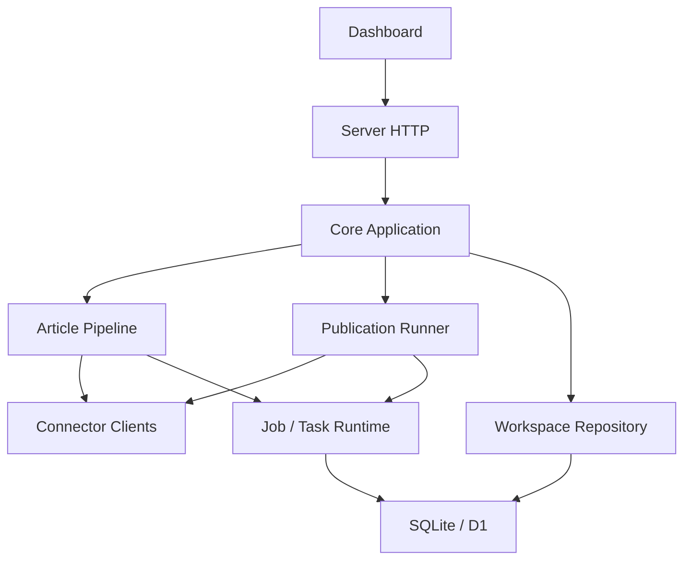
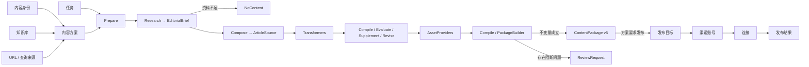

# 架构

TrendPublish 是一个边界清晰的 modular monolith。它没有通用 DAG 编辑器；文章生产使用稳定的 Pipeline，并通过四类窄插件能力扩展。

## 包边界

### Runtime

`packages/runtime` 不知道文章、渠道或 Connector。它提供 Job 生命周期、Task 检查点、输入指纹和三种副作用语义：

- `pure`：纯计算，可安全重放。
- `idempotent`：相同幂等键可安全再次调用。
- `unsafe`：执行器失联后结果未知，必须进入 `needs_attention`，不能盲目重发。

### Connectors

`packages/connectors` 是可独立使用的外部服务包。每个 Connector 声明设置 schema、凭证 schema、表单字段、能力和连接测试，并创建类型化 Client。Client 只完成一次 API 调用、协议映射和错误归一化。

连接实例由 `ConnectorClientResolver` 按 revision 缓存；修改连接会失效缓存。请求覆盖在标准请求形成后合并，认证字段最后写入。

### Article

`packages/article` 提供文章生产的固定 Pipeline、模型友好的文章来源、确定性文档编译器和内容包构造边界。

研究阶段产出一个 `EditorialBrief`，集中保存选题、论点、提纲、素材快照、精确证据和信息缺口。查询先通过 `source-search` 发现候选 URL，再通过 `source-fetch` 抓取正文；搜索 snippet 永远不能成为正式素材。每条 `EvidenceUnit` 必须通过摘录、时间段或页码精确定位到抓取并冻结的素材。作者或大模型只写带注解的 Markdown `ArticleSource`，事实引用使用 `evidence://<ID>`；`ArticleCompiler` 把它解析成 `ArticleDocument` AST。编译器要求成品至少引用一条有效证据，校验定位结构，并在素材中存在可比较文本时核对摘录。系统不要求模型生成 AST，也不会把任意 Markdown 留给渠道自行解释。

插件只有四种能力：

- `ArticleTransformer` 修改 `WorkingArticle`，返回的仍然是文章来源，而不是 AST。
- `ArticleEvaluator` 只读检查编译视图，返回绑定 `sourceHash` 的诊断和需要补充的事实问题。
- `ArticleEvidenceSupplementer` 消费事实问题，并复用 ResearchTool 补充可定位的素材与证据。
- `AssetProvider` 把一个 `AssetRequest` 解析成一个 `ContentAsset`。

质量循环由 Pipeline 集中控制，插件不能各自隐藏无限重试。同一个 quality round 依次执行编译检查、Evaluator、可选 EvidenceSupplementer 和统一 ArticleReviser，再进入下一轮复评；补证不拥有独立轮次。资源请求只区分 `enhancement` 与 `essential`：增强资源失败时移除对应占位并保留警告，必要资源失败时进入人工审阅。人工完成审查时提交修订后的 `ArticleSource` 与 `AssetRequest[]`，再从编译、评估和资源处理继续；人工和 API 都不直接编辑 AST。最后 `ContentPackageBuilder` 独立复核来源、文档、证据定位、至少一条有效引用和资源引用，再冻结 `ContentPackage v5`。

`ContentAsset.checksum` 是资源实际字节的 SHA-256，不是 URI 的散列。内置封面 Provider 会立即下载生成结果、以内联 Data URI 冻结字节并据此计算 checksum；发布 Adapter 在上传前再次校验读取到的字节。`ContentPackage.checksum` 则保护完整冻结载荷，发布入口必须先验证它。

`ContentPackage`、`ReviewRequest` 和 `NoContent` 都是正常业务结果，Job 仍然成功。只有执行异常才会让 Job 失败或进入 `needs_attention`。

### Publishing

`packages/publishing` 只消费冻结内容包。渠道账号保存渠道和连接；发布目标只引用渠道账号并保存输出配置，不绑定内容身份。同一内容包可以向多个目标扇出，每个目标单独保存结果。

微信 Adapter 把素材上传、正文图片替换和草稿创建拆成稳定子步骤。微信公众号要求封面，因此启用自动发布的内容方案在生产前就必须启用封面插件、把封面设为 `essential` 并绑定图片连接；缺少这些条件不会延迟到发布阶段才发现。真正产生外部副作用的步骤使用不安全副作用检查点，避免网络中断后重复发布。

### Core 与 Server

`packages/core` 保存工作区对象并实现文章生成、人工修订完成和发布用例。`apps/server` 是唯一装配根：本地装配 SQLite，Cloudflare 装配 D1；HTTP 层只依赖一个 `ApplicationRuntime`。

## 运行数据流

职责约束：

- 任务只保存触发方式和运行时指令，并引用一个内容方案。
- 内容方案显式组合身份、知识库、URL / 查询来源、研究连接、可选插件、模型连接和输出方式。
- 知识库只保存上传型长期材料；数据来源保存 URL 或查询，不接受静态正文。
- Research 可以按需调用来源工具，不再在写作前无差别抓取全部来源。`source-search` 只发现候选 URL，`source-fetch` 只抓取正式文档；查询来源必须同时具备搜索与抓取能力。内容方案选择的搜索连接全部参与并合并结果，网页抓取连接按顺序回退；空选择表示自动使用一个兼容连接。初始研究和补充论证共享同一个 `ResearchCollector`，统一执行发现、抓取、去重和失败隔离。
- 插件必须由内容方案显式保存；执行时不自动注入默认插件。基本内容、语法和引用完整性由编译器与 PackageBuilder 保证，不是插件。
- Transformer 每次修改文章来源后必须重新编译；Evaluator 不得修改内容；EvidenceSupplementer 只能通过 ResearchTool 增加可校验证据；AssetProvider 不得承担渠道上传。
- 渠道 Adapter 只做确定性的技术转换、上传和字段映射，不使用大模型重新表达文章语义。
- 发布目标不反向绑定内容身份。渠道适配阶段根据内容包生成渠道稿。
- 审查请求独立保存；它不是 Job 状态，也不会让生成任务降级。
- 人工完成审查只提交 `ArticleSource` 和 `AssetRequest[]`；可以修改或删除资源请求，但对应的 Markdown 占位符也必须同步调整。内容方案声明的渠道必要资源会在完成流程中重新补齐或提升为 `essential`。
- 内容包不知道未来发布到哪里，只保存结构化文档、内容资源、证据和原始素材的引用关系。
- 渠道上传、URL 替换、转码和渠道字段派生只发生在发布适配阶段。

## 数据模型

- `Automation`：长期任务定义，只组合内容方案、运行时指令和触发方式。
- `ContentIdentity`：内容定位、受众、语气和表达边界。
- `KnowledgeBase`：上传型长期参考材料。
- `SourceCollection`：一组可启停的 URL 或查询输入配置；它保存研究入口，不保存抓取后的正文。
- `ContentPlan`：身份、参考输入、可选插件、连接与输出方式组成的生产配置。
- `MaterialSnapshot`：抓取或上传后冻结的研究输入，可表示网页、图片、视频、音频和文档。
- `EvidenceUnit`：一条可验证陈述到冻结素材位置的精确引用，可定位文本摘录、视频时间段或文档页码；定位必须能被校验。
- `EditorialBrief`：研究向写作交付的唯一对象，包含主题、角度、论点、提纲、素材、证据和缺口。
- `ArticleSource`：作者和大模型直接编辑的带注解 Markdown，包含标题、摘要和正文。
- `ArticleDocument`：由系统编译、供插件读取和渠道渲染的稳定 AST。
- `AssetRequest`：文章对封面、插图、图表或示意图的生产意图，只区分增强与必要。
- `ContentAsset`：最终内容实际使用的图片、视频、音频或附件；checksum 是实际资源字节的 SHA-256。内置封面会把字节以内联 Data URI 冻结在内容包中。
- `ContentPackage`：渠道无关的冻结成品，持有 Source、Document、证据、素材引用、资源、身份、构建和质量快照。每次构建生成唯一 ID；checksum 只校验冻结载荷完整性，发布前必须验证，不能充当业务 ID。
- `ReviewRequest`：阻断问题、待修 `WorkingArticle`、`EditorialBrief` 和诊断组成的独立人工处理请求；完成时回填 Source 与资源请求，不回填 AST。
- `NoContent`：研究证据不足、不值得继续写作时的正常成功结果。
- `ChannelAccount`：渠道类型和 Connector 连接。
- `PublishTarget`：渠道账号与输出配置组成的可复用发布目标。
- `StoredPublication`：一次多目标发布的完整结果。

旧 `workflow`、`integrations`、`agents` 包与旧迁移表不属于当前架构，也没有兼容桥。
