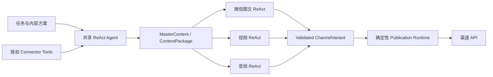

# 架构

TrendPublish 是一个以原生 Tool Calling ReAct 为核心的 modular monolith。系统不维护固定文章流水线，也不把真实发布副作用交给模型。

## Agent 与工具

`packages/agent` 提供通用 ReAct 循环。模型通过标准 `tools`、`tool_calls` 和 tool observation 交互。模型调用本身可以安全重试，不写入 Task 检查点；工具调用按副作用语义成为可恢复 Task。运行记录只保存轮次生命周期、公开工具动作、脱敏参数和 observation，不保存模型原始文本、Tool Call 参数增量或隐藏推理。

连接不是直接暴露给模型的任意 API。Connector 声明类型化能力，应用层把内容方案明确授权的连接转换成窄工具，例如来源搜索、网页抓取、图片生成、语音合成或视频生成。工具拥有独立 JSON Schema、版本和副作用语义。

默认预算为 24 个 turn 和 16 次工具调用，内容方案可以在安全范围内覆盖。模型没有在预算内调用终止工具提交合法结果时，当前会话失败。

## 实时运行记录

一次用户级 `RunRecord` 覆盖完整执行：内容运行有一个主 `RunSession`，并按目的地创建零到多个发布 `RunSession`；内容包稍后手动发布时创建新的发布运行，并通过 `originRunId` 与原生成运行互链。内部 Job、Task、检查点和幂等键继续承担恢复职责，不直接作为 Dashboard 的信息架构。

每个会话按实际发生顺序写入 `RunActivity`。模型轮次、工具调用、结构化提交、格式准备、素材上传、外部发布和回执都使用稳定 `sequence`；活动必须先落库，再发布 `run.activity` 事件。客户端通过 `/api/runs/:runId/events` 断线续传，刷新或服务重启后仍能恢复完整活动。

模型 API 实际返回的 assistant 文本 delta 和 Tool Call 参数 delta 走独立的临时流。Dashboard 将它们合并到对应“模型轮次”活动内部实时显示；这些增量不写数据库、Task 输出或应用日志，也不支持历史回放。连接中断或页面刷新后，活动状态仍可恢复，但丢失的原始增量明确显示为不可恢复。

## 共享内容生产

共享 Agent 获得内容身份、策略预设、任务指令、知识库入口、来源配置和授权工具。策略只声明目标、证据原则与表达偏好，不规定研究、写作或增强顺序。

Agent 最终通过 `submit_master_content` 提交：

- 主题、角度、概要和核心论点；
- Markdown 主稿；
- 可定位证据与素材引用；
- 内容声明和资源生产意图；
- Agent 策略、模型和预算快照。

提交结果先经过确定性编译和完整性校验，再冻结为带 `MasterContent` 的 `ContentPackage v5`。历史内容包没有 `master` 字段，仍然可以读取和发布。

“去 AI 化”“风格优化”等属于 Agent 可调用增强工具，不形成固定后处理队列。搜索摘要不能直接成为证据；具体事实必须引用抓取并冻结的材料。

Agent 对外只有最大轮次一项预算。最后一个允许轮次是强制收口轮：执行器隐藏普通工具，只开放当前所需的完整提交或候选修复工具，并要求模型提交当前最佳结构化结果。上下文长度控制属于执行器内部安全机制，不是内容方案预算。

## 发布类型与渠道变体

渠道不是单一格式。每个渠道注册一个或多个版本化 `PublicationTypeProfile`，例如微信图文、短视频、长视频或播客节目。Profile 声明：

- 支持的媒体模态；
- 必需和可选产物；
- 领域指令；
- 输出 JSON Schema；
- 校验器与发布执行器版本。

每个 `accountId + publicationType + options` 目的地启动独立适配 ReAct 会话。会话只看到共享内容、当前目的地的非敏感设置、对应 Profile 和适配工具。合法输出冻结为 `ChannelVariant`，持有内容包 checksum、目的地指纹、Profile 版本、载荷和资源引用。

微信公众号图文 Profile 要求标题、摘要、安全 HTML、封面资源和正文资源清单。主 ReAct 不根据发布目的地提前生产素材；微信发布 ReAct 可以调用确定性 HTML 初稿工具和封面生成工具，在当前目的地会话内获取、冻结并组装渠道资源。没有可用图片连接时，渠道工具生成可上传的中性兜底封面。最终载荷必须通过微信领域校验；不合法结果会作为 observation 返回修复，最后一个允许轮次会强制提交或修复当前最佳渠道稿，仍无法通过校验时仅当前目标失败。

相同内容包、Profile 版本、发布类型和内容设置可以在后续按 fingerprint 复用同一渠道变体；账号凭证和发布时字段不进入 fingerprint。

## 发布安全边界

真实渠道发布不是 Agent Tool。`PublicationRunner` 只消费已校验的渠道变体，冻结 `PreparedPublication` 后再执行资源上传、占位符替换和渠道 API 调用。

纯计算和可安全重复的步骤可从检查点恢复；创建草稿等外部副作用使用 `unsafe` Task。网络中断导致结果未知时进入 `needs_attention`，不得让 Agent 或恢复器自动重发。

多目的地独立执行。单个格式会话或账号失败不会抹掉其他成功结果，批次状态聚合为 `succeeded`、`partial`、`failed` 或 `needs_attention`。

## 核心领域对象

- `ContentPlan`：Agent 策略、模型、授权工具、增强能力、预算、身份、输入与发布目的地选择。
- `MasterContent`：共享主题、论点、Markdown 主稿、声明与 Agent 快照。
- `ContentPackage`：冻结的共享内容、证据、素材、资源和完整性 checksum。
- `PublicationTypeProfile`：一种渠道发布类型的领域规则、Schema 和校验器。
- `ChannelVariant`：独立渠道 ReAct 会话生成并验证的内容变体。
- `PreparedPublication`：绑定目的地、账号和 Adapter 版本的不可变发布载荷。
- `PublishReceipt`：真实渠道 API 返回的发布结果。
- `RunRecord`：一次完整内容或手动发布运行及其聚合状态。
- `RunSession`：主 ReAct 或单个发布目的地的独立会话。
- `RunActivity`：先持久化后推送、可按序恢复的结构化活动。

新增渠道只需要注册 Profile、校验器和发布执行器；新增媒体能力只需要增加工具与相应发布类型，不修改共享 ReAct 主循环。
